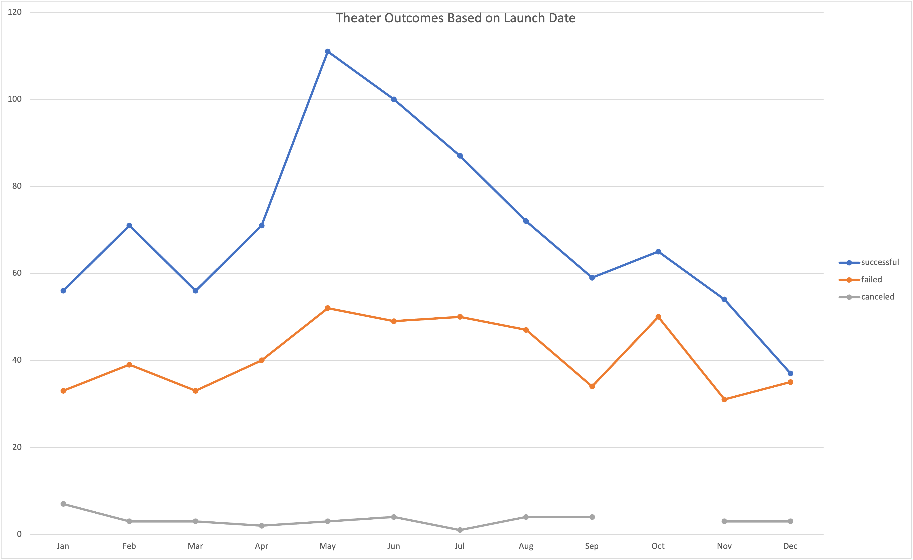
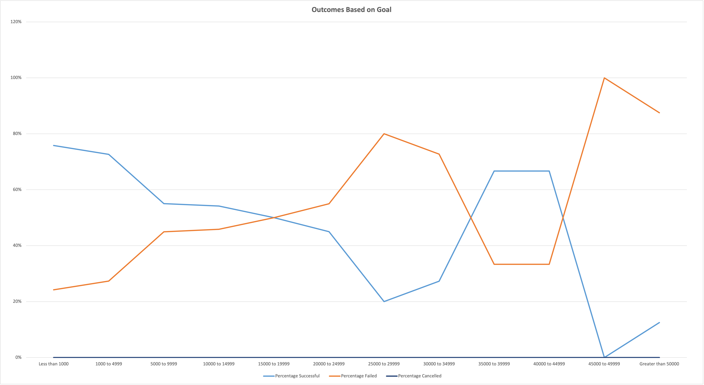

# Kickstarting with Excel

## Overview of Project

As the first project for the UC Davis Data Analytics class, we are attempting to use data to gain insight into why Louise's kickstart campaign for the play *Fever* came close, but still missed it's fundraising goal.  Using the data provided we were able to look at the outcomes of other kickstarter campaigns and compare their success or failure based on when in the year they launched their campaign and the amount each set as a goal.  After analyzing the data, we hope to discover if the goal amount Louise set was reasonable or if it contributed to it's failure and if the time of year it was launched helped or hurt the campaign.  

## Analysis and Challenges

We were given data from 4114 different kickstarter campaigns.  This data contained information about the goals, the actual amount pledged, the outcome of the campaign, how many backers it had, the type of campaign, when it started, and when it ended.  We've decided to analyze the data in two different ways, first by comparing the campaign outcomes relative to their launch date.  The hope was do discover if there was any advantage or disadvantage based on when the campaign launched.  The other analysis was to look at the goals that were set by each campaign and see if the goal that was set for Louise's play helped or hindered it's success.

### Analysis of Outcomes Based on Launch Date
The first analysis performed was based on the launch date of the campaign.  The data needed to be filterd by the main category to include only the Theater campaigns, broken into their outcomes, and graphed based on the month they were launched.  Creating a pivot table and using it to build a line graph, we were able to easily see that some months were quite a bit more successful than others.  The graph is linked below.  

### Analysis of Outcomes Based on Goals

The second analysis performed was based on the amount that was set for the goals of the campaigns.  Since the goal amounts vary greatly based on the type of campaign, we've further limited the comparisons to only Theater campaigns that are for plays.  We looked at the percent of each outcome based on different levels of funding goals set.  We broke the levels out by increments of $5000 starting with less than $1000 to over $50,0000 to see if campaigns were more successful or more likely to fail based on their goal.  The below line graph shows the percent outcomes for each funding level grouping.

### Challenges and Difficulties Encountered

There were a few challenges in perparing the data for analysis.  the first challenge was that the date for campaign launch and campaign deadline was given as a Unix timestamp, which isn't recognized as a valid date in Excel and thus had to be converted before it could be used as a date for our calculations.  The second challenge was that we needed to be able to filter out the data to exclude campaigns that were not Theater campaigns or not plays.  The last challenge was to be able to break out the goal amounts into different groupings and the launch dates grouped into months.  

## Results

After looking at the data there are a few conclusions that I have been able to draw.  Looking first at the graph showing outcomes based on Launch Date, I could draw two conclusions, one is that there are much more campaigns that launch during the summer months, May and June, than in the winter months, December and January.  The other is that a higher percentage of those launching in the summer month succeed compared to those launching in the winter.  Since the play started in June, it's start date was well placed for success.  

Looking at the analysis of outcomes based on the goal amount.  The graph seems to indicate that campaigns under $5,000 had the highest levels of success.  As the goal amount increased, the percentage of campaigns succeeding falls off sharply until it gets between $35,000 and $45,000 where it rises again before completely falling off over $45,000.  Based on this, the goal for the Fever campaign of $2,885 was well placed for success as 73% of the campaigns in that range met their fundraising goals.

Based on the two analyses done, it seems that the campaign was launched at the right time and had a modest goal amount giving it a high likelihood of success.
What the graphs are not showing are things like how long the campaign ran for compared to other campaigns or how many people participated in the campaigns and what the size of their donations were.  Perhaps the campaign was stopped early, before it could reach it's goal.  Perhaps the campaigns that succeeded relyed on lots of small donors or perhaps a small amount of large donors.  I would suggest running an analysis on the outcomes vs the length of the campaigns, and another one comparing the outcome to the number of participants or the average size of donations. These two analyses may give a better explaination of why the Fever campaign fell short of its goal, especially when combined with the graphs already provided.    
